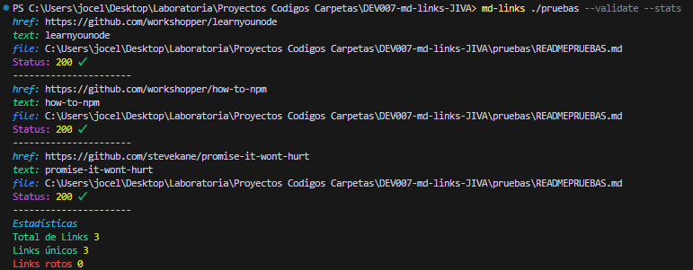

# Markdown Links - JIVA

## Índice

- [1. Introducción](#1-introducción)
- [2. Resumen del proyecto](#2-resumen-del-proyecto)
- [3. Instalación](#3-instalación)
- [4. Instrucciones de uso](#4-instrucciones-de-uso)
- [5. Planificación](#5-planificación)
- [6. Test unitarios](#6-test-unitarios)
- [7. Referencias](#7-referencias)

---

## 1. Introducción

Hola Coders :sunglasses: [Markdown](https://es.wikipedia.org/wiki/Markdown) es un
lenguaje de marcado ligero muy popular entre developers. Es usado en muchísimas
plataformas que manejan texto plano (GitHub, foros, blogs, ...) y es muy común
encontrar varios archivos en ese formato en cualquier tipo de repositorio
(empezando por el tradicional `README.md`).

Estos archivos `Markdown` normalmente contienen _links_ (vínculos/ligas) que
muchas veces están rotos o ya no son válidos y eso perjudica mucho el valor de
la información que se quiere compartir.

Dentro de una comunidad de código abierto, nos han propuesto crear una
herramienta usando [Node.js](https://nodejs.org/), que lea y analice archivos
en formato `Markdown`, para verificar los links que contengan y reportar
algunas estadísticas.

## 2. Resumen del proyecto

Es una herramienta de línea de comando (CLI) :computer: una librería
(o biblioteca - library) en JavaScript.

Con esta herramienta podrás analizar :mag: tus archivos Markdown (.md) y
verificar :white_check_mark: los links encontrados.

Esta librería te dirá que links están en tu archivo, cuál es su estado de validación
y estadísticas de cuales links son válidos, únicos y rotos (no válidos).

## 3. Instalación

Debes realizarla por npm:

```
npm i md-links
```

## 4. Instrucciones de uso

Para que la librería :archivador: opere de manera correcta debes ingresar la ruta para analizar,
si no ingresas te mostrara el error, aquí unos ejemplos:

Ingresas de esta forma tu ruta

```
md-links <tu-ruta>
```

- Ejemplo si no ingresas ruta


- Ejemplo si ingresas una ruta errónea


- Ejemplo ruta correcta


#### Opciones

Dentro de la librería tenemos opciones `--validate` y `--stats`, aquí te muestro su uso.

`--validate`

Si pasamos la opción `--validate`, el módulo hace una petición HTTP para
averiguar si el link funciona o no. Si el link resulta en una redirección a una
URL que responde ok, entonces consideraremos el link como ok.

- Ejemplo `md-links <ruta-ejemplo> --validate`


`--stats`

Si pasamos la opción `--stats` el output (salida) será un texto con estadísticas
básicas sobre los links.

- Ejemplo `md-links <ruta-ejemplo> --stats`


También podemos combinar `--stats --validate` o `--validate --stats` para obtener estadísticas que necesiten de los resultados de la validación.

- Ejemplo

`md-links <ruta-ejemplo> --stats --validate`


`md-links <ruta-ejemplo> --validate --stats`



## 5. Planificación

Para este proyecto inicie con un Diagrama de Flujo que fue plasmando paso a paso
las tareas a realizar dentro del código.

DIAGRAMA DE FLUJO


Ya teniendo las ideas de este proyecto me organice con Trello y Project GitHUb

TRELLO


PROJECT GITHUB


## 6. Test unitarios

Para este proyecto se realizaron test a todo el módulo de funciones.js

TEST


## 7. Referencias

:wink:

- [Acerca de Node.js - Documentación oficial](https://nodejs.org/es/about/)
- [Asíncronía en js](https://carlosazaustre.es/manejando-la-asincronia-en-javascript)
- [NPM](https://docs.npmjs.com/getting-started/what-is-npm)
- [Linea de comando CLI](https://medium.com/netscape/a-guide-to-create-a-nodejs-command-line-package-c2166ad0452e)
- [recurso](https://www.youtube.com/watch?v=Lub5qOmY4JQ).

### **Realizado por :sparkles: **

```
https://github.com/JoceChile
```
